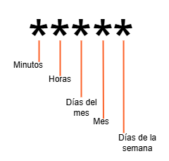

# Tutorial de introduccion

:::tip[USO FACIL]

API facil de implementar en cualquier proyecto.

:::

## Expresion crom valida

La expresion crom para este servicio es la siguiente

import TableFalconix from "@site/src/components/TableFalconix"; 

<TableFalconix thead="*,*,*,*,*">
<tr>
    <td>Minutos</td>
    <td>Horas</td>
    <td>Dias del mes</td>
    <td>Mes</td>
    <td>Dias de la semana</td>
</tr>
</TableFalconix>

